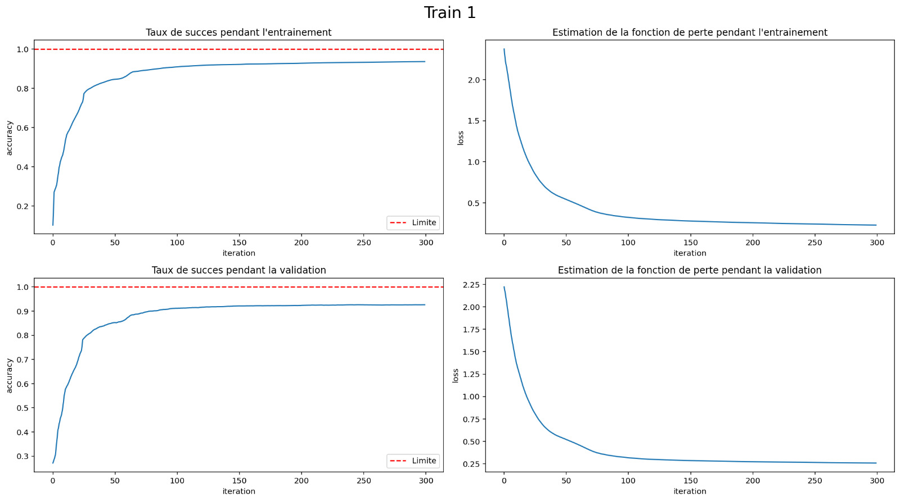
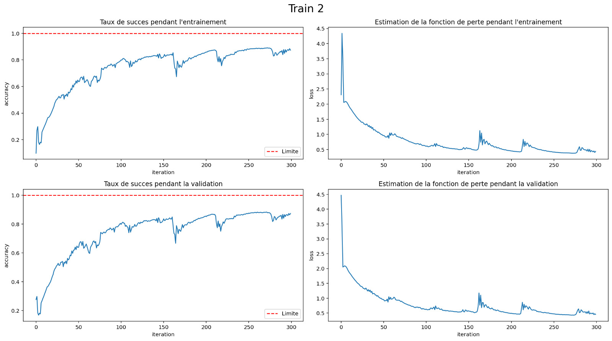
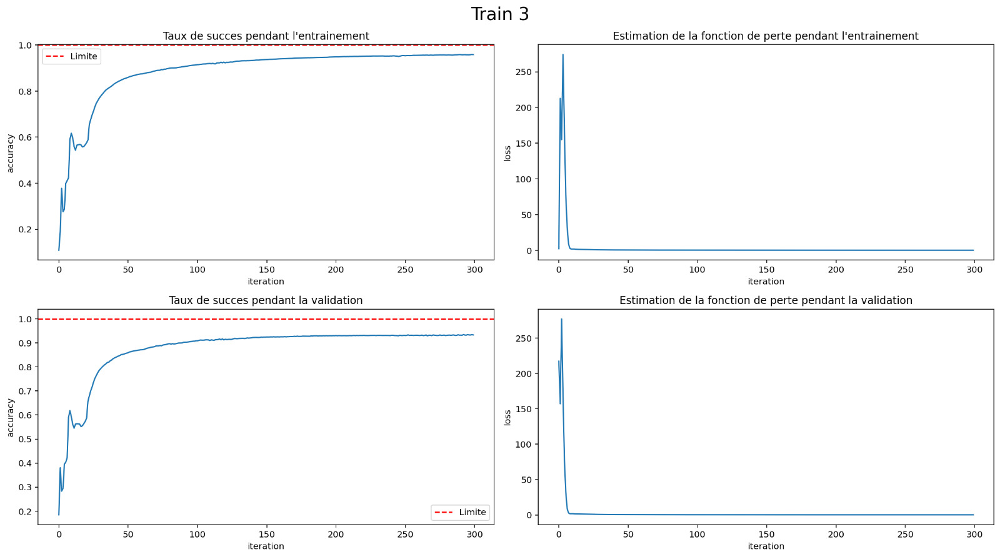
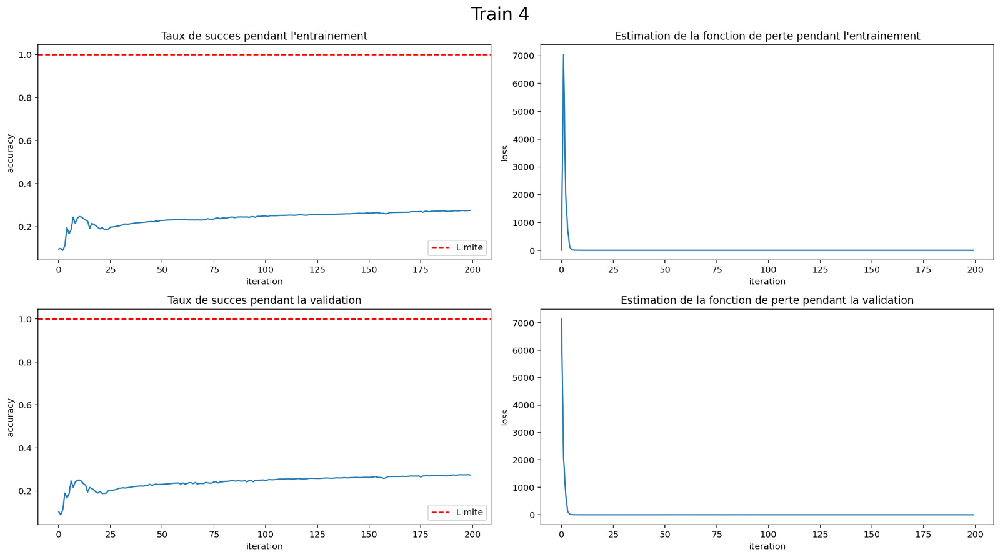
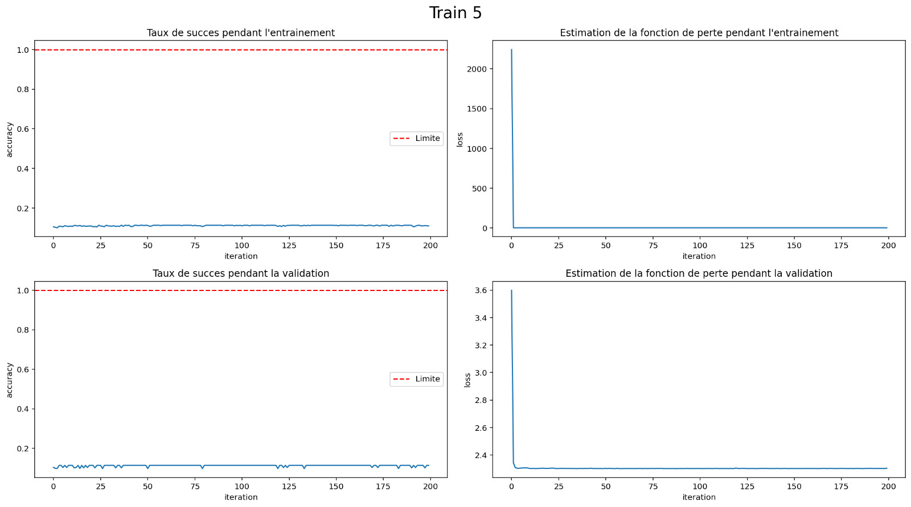

# TP3 - Réseau de Neurones - Perceptron

# Contents:

- [README](#readme)
- [Fonctionnalités](#fonctionnalites)
- [Installation](#installation)
- [Utilisation](#bruitblanc)
- [Contributions](#contributions)
- [Contributeurs](#contributeurs)
- [License](#license)
- [Documentation](#documentation)
- [Réponses aux Questions](#reponse-aux-questions)


# README

Le readme du projet

## Fonctionnalites

Le logiciel répond aux questions du TP3, sur la création d'un réseau de neurones permettant de détecter un nombre écrit à la main.

## Installation

1. Clonez le dépôt GitHub :
   
    ```bash
    $ git clone git@gitlab.in2p3.fr:dimitri.buffat/m2cosmo_tp3.git
    ```
   
2. Allez dans le dossier du package :

    ```bash
    $ cd m2cosmo_tp3
    ```
   
3. Installez le package à l'aide de pip :

    ```bash
    $ pip install .
    ```
   
    Si vous n'avez pas pip, vous pouvez utiliser : 
   
    ```bash
    $ python3 setup.py install
    ```

## Utilisation

Après installation, il suffit de taper 
  ```bash
      $ NeuralNumpy
  ```
Entraîne le réseau de neurones construit 'à la main' avec Numpy. Et l'entraîne à partir des données du fichier train.csv. (Partie 1)

  ```bash
      $ NeuralKeras
  ```
Entraîne 5 architecture de neurones différentes, construites avec Keras, et entraînées sur les données MNIST.
  ```bash
      $ Keras1
  ```
Lance uniquement la première architecture de réseau de neurones, construite avec Keras. 3 couches (1 cachée de 10 neurones) et taux d'apprentissage de 0.01

  ```bash
      $ Keras2
  ```
Lance uniquement la deuxième architecture de réseau de neurones, construite avec Keras. 3 couches (1 cachée de 10 neurones) et taux d'apprentissage de 0.2

  ```bash
      $ Keras3
  ```
Lance uniquement la troisième architecture de réseau de neurones, construite avec Keras. 3 couches (1 cachée de 500 neurones) et taux d'apprentissage de 0.2

  ```bash
      $ Keras4
  ```
Lance uniquement la quatrième architecture de réseau de neurones, construite avec Keras. 4 couches (2 cachée de 500 et 700 neurones) et taux d'apprentissage de 0.2

  ```bash
      $ Keras5
  ```
Lance uniquement la quatrième architecture de réseau de neurones, construite avec Keras. 4 couches (2 cachée de 500 et 700 neurones) et taux d'apprentissage de 0.2 et un échantillon d'entraînement divisé par 10

## Contributions

Les contributions sont les bienvenues! Pour contribuer à 2048 veuillez suivre ces étapes :

1. Forkez le projet.

2. Créez une branche pour votre fonctionnalité 
	```bash
	$ git checkout -b feature-nouvelle-fonctionnalité
	```

3. Commitez vos changements.
	```bash
	$ git commit -m Ajout d une nouvelle fonctionnalité'
	```

4. Poussez votre branche.
	```bash
	$ git push origin feature-nouvelle-fonctionnalité
	```


5. Ouvrez une Pull Request.

## Contributeurs

Merci aux personnes ayant contribué à ce projet :  
- THOMEER Matthieu
- BUFFAT Dimitre

## License

Ce projet est sous licence MIT. Consultez le fichier LICENSE pour plus de détails.

# Documentation

# tp3_pkg package

## Submodules

## tp3_pkg.neurones module

### *class* tp3_pkg.neurones.NeuralNetwork(lambda_1=1.0, lambda_2=0.1, iterations=100)

Bases : `object`

Implémentation d’un réseau de neurones simple pour la classification avec propagation arrière.

#### lambda_1

Coefficient d’apprentissage initial.

* **Type:**
  float

#### lambda_2

Coefficient d’apprentissage secondaire.

* **Type:**
  float

#### iterations

Nombre d’itérations d’entraînement.

* **Type:**
  int

#### Données

#### data_numpy

Jeu de données chargé depuis un fichier CSV.

* **Type:**
  numpy.ndarray

#### X_train

Données d’entraînement normalisées.

* **Type:**
  numpy.ndarray

#### Y_train

Étiquettes des données d’entraînement.

* **Type:**
  numpy.ndarray

#### X_dev

Données de validation normalisées.

* **Type:**
  numpy.ndarray

#### Y_dev

Étiquettes des données de validation.

* **Type:**
  numpy.ndarray

### Paramètres du réseau

### W0, W1

Matrices de poids pour chaque couche.

* **Type:**
  numpy.ndarray

### b0, b1

Vecteurs de biais pour chaque couche.

* **Type:**
  numpy.ndarray

#### Gradients

### dJdW0, dJdW1

Gradients des poids pour la propagation arrière.

* **Type:**
  numpy.ndarray

### dJdb0, dJdb1

Gradients des biais pour la propagation arrière.

* **Type:**
  numpy.ndarray

#### Autres

#### rep

Liste des prédictions du réseau.

* **Type:**
  list

#### success_

Historique des précisions à chaque étape d’entraînement.

* **Type:**
  list

#### \_\_init_\_(lambda_1=1.0, lambda_2=0.1, iterations=100)

#### RunMain()

Lance l’ensemble du processus : lecture des données, normalisation,
initialisation des paramètres et entraînements (avec deux taux d’entraînement).

* **Paramètres:**
  **None**
* **Type renvoyé:**
  None

#### \_read_data()

Lit les données d’entraînement depuis un fichier CSV et les convertit en tableaux NumPy.

Cet appel mélange les données pour garantir une distribution aléatoire.

* **Paramètres:**
  **None**
* **Type renvoyé:**
  None

#### \_sampling()

Sépare les données en deux ensembles :
- Échantillon de validation (X_dev, Y_dev)
- Échantillon d’entraînement (X_train, Y_train)

Cela utilise les 1000 premiers exemples pour la validation et le reste pour l’entraînement.

* **Paramètres:**
  **None**
* **Type renvoyé:**
  None

#### \_norm()

Normalise les caractéristiques (X) en divisant chaque valeur par 255
pour s’assurer que toutes les caractéristiques se situent entre 0 et 1.

* **Paramètres:**
  **None**
* **Type renvoyé:**
  None

#### \_init_W_b()

Initialise les poids et biais pour le réseau de neurones avec des valeurs aléatoires
entre -0.5 et 0.5.

* **Paramètres:**
  **None**
* **Type renvoyé:**
  None

#### \_init_derivate()

Initialise les matrices de dérivées à zéro pour les poids et biais
du réseau.

* **Paramètres:**
  **None**
* **Type renvoyé:**
  None

#### \_ReLU(Z)

Applique la fonction d’activation ReLU à un tableau.

* **Paramètres:**
  **Z** (*numpy.ndarray*) – Entrée pour la fonction d’activation.
* **Renvoie:**
  Sortie après application de ReLU.
* **Type renvoyé:**
  numpy.ndarray

#### \_softmax(Z)

Applique une fonction softmax à l’entrée.

* **Paramètres:**
  **Z** (*numpy.ndarray*) – Vecteur contenant les valeurs d’entrée.
* **Renvoie:**
  Vecteur après application de softmax.
* **Type renvoyé:**
  numpy.ndarray

#### \_prop_av(X_i)

Effectue une propagation en avant à travers le réseau pour une seule entrée.
Le vecteur A1 est le vecteur de réponse, l’indice qui a la plus grande valeur associée est considérée comme la réponse du réseau de neurones.

* **Paramètres:**
  **X_i** (*numpy.ndarray*) – Exemples d’entrée pour le réseau.
* **Type renvoyé:**
  None

#### \_dReLU_dz(Z)

Calcule la dérivée de ReLU par rapport à Z en retournant 1 pour les
valeurs positives, et 0 pour les valeurs négatives.

* **Paramètres:**
  **Z** (*numpy.ndarray*) – Entrée pour laquelle calculer la dérivée.
* **Renvoie:**
  Dérivée de ReLU évaluée point par point.
* **Type renvoyé:**
  numpy.ndarray

#### \_value_to_array(Y_i)

Convertit une valeur Y en tableau encodé unilatéral.

* **Paramètres:**
  **Y_i** (*int*) – Valeur cible à encoder.
* **Renvoie:**
  Tableau de longueur 10 avec un seul « 1 » au bon indice.
* **Type renvoyé:**
  numpy.ndarray

#### \_prop_ar(X_i, Y_i)

Effectue une rétropropagation pour calculer les gradients des poids et biais
en utilisant les erreurs entre la sortie prédite et la cible.

* **Paramètres:**
  * **X_i** (*numpy.ndarray*) – Exemple d’entrée utilisé pour la rétropropagation.
  * **Y_i** (*int*) – Étiquette de classe réelle pour l’entrée X_i.
* **Type renvoyé:**
  None

#### \_refresh_matrix(lambda_)

Met à jour les poids et les biais avec les gradients calculés via rétropropagation,
appliquant la descente de gradient stochastique.

* **Paramètres:**
  **lambda** (*float*) – Coefficient d’apprentissage utilisé pour ajuster les paramètres.
* **Type renvoyé:**
  None

#### \_end_value()

Détermine la classe prédite en prenant l’indice de la valeur maximale du vecteur de sortie.

Une fois déterminée, la classe prédite est ajoutée à la liste des réponses du réseau.

* **Paramètres:**
  **None**
* **Type renvoyé:**
  None

#### \_comparaison(use)

Compare les prédictions du réseau avec les véritables étiquettes pour calculer la précision.

* **Paramètres:**
  **use** (*str*) – Indique quel ensemble de données utiliser : “train” pour l’entraînement
  ou tout autre valeur pour la validation.
* **Renvoie:**
  Le pourcentage de détections correctes.
* **Type renvoyé:**
  float

#### \_run_train(lambda_)

Entraîne le réseau de neurones sur l’ensemble des données d’entraînement
en utilisant la rétropropagation.

* **Paramètres:**
  **lambda** (*float*) – Coefficient d’apprentissage utilisé pour la mise à jour des poids
  et des biais.
* **Type renvoyé:**
  None

#### \_run_dev()

Effectue la validation du réseau de neurones sur l’ensemble des données de validation.

Cette méthode applique une propagation avant pour chaque exemple, compare les
prédictions générées avec les étiquettes réelles et affiche la précision.

* **Paramètres:**
  **None**
* **Type renvoyé:**
  None


## tp3_pkg.neurones_keras module

### *class* tp3_pkg.neurones_keras.NeuralNetworkKeras

Bases : `object`

Classe pour entraîner et évaluer des réseaux de neurones sur le jeu de données MNIST
en utilisant Keras.

#### X_train

Données d’entraînement normalisées.

* **Type:**
  numpy.ndarray

#### Y_train

Étiquettes des données d’entraînement.

* **Type:**
  numpy.ndarray

#### X_test

Données de test normalisées.

* **Type:**
  numpy.ndarray

#### Y_test

Étiquettes des données de test.

* **Type:**
  numpy.ndarray

#### Y_train_arr

Étiquettes d’entraînement en one-hot encoding.

* **Type:**
  numpy.ndarray

#### Y_test_arr

Étiquettes de test en one-hot encoding.

* **Type:**
  numpy.ndarray

#### model

Modèle de réseau de neurones.

* **Type:**
  keras.models.Sequential

#### Adam

Optimiseur Adam.

* **Type:**
  keras.optimizers.Adam

#### out

Historique de l’entraînement du modèle.

* **Type:**
  keras.callbacks.History

#### \_\_init_\_()

#### \_compile_data()

Compile les données d’entraînement et de test en important et en convertissant
les valeurs des étiquettes en one-hot encoding.

* **Paramètres:**
  **None**
* **Type renvoyé:**
  None

#### RunMain()

Lance les différents modèles les uns à la suite des autres.

* **Paramètres:**
  **None**
* **Type renvoyé:**
  None

#### Run1()

Lance le premier modèle d’entraînement du réseau de neurones.
L’intérêt est de pouvoir choisir quel modèle on veut utiliser. Cela permet d’éviter de sur-utiliser la RAM.

* **Paramètres:**
  **None**
* **Type renvoyé:**
  None

#### Run2()

Lance le second modèle d’entraînement du réseau de neurones.

* **Paramètres:**
  **None**
* **Type renvoyé:**
  None

#### Run3()

Lance le troisième modèle d’entraînement du réseau de neurones.

* **Paramètres:**
  **None**
* **Type renvoyé:**
  None

#### Run4()

Lance le quatrième modèle d’entraînement du réseau de neurones.

* **Paramètres:**
  **None**
* **Type renvoyé:**
  None

#### Run5()

Lance le cinquième modèle d’entraînement du réseau de neurones.

* **Paramètres:**
  **None**
* **Type renvoyé:**
  None

#### \_import_data()

Importe et normalise le jeu de données MNIST.

* **Paramètres:**
  **None**
* **Type renvoyé:**
  None

#### \_value_to_array()

Convertit les étiquettes en one-hot encoding pour l’entraînement et le test.

* **Paramètres:**
  **None**
* **Type renvoyé:**
  None

#### \_train_1(n=300)

Entraîne un modèle de réseau de neurones simple avec une couche dense.

* **Paramètres:**
  **n** (*int* *,* *optional*) – Nombre d’époques pour l’entraînement, par défaut 300.
* **Type renvoyé:**
  None

#### \_train_2()

Entraîne un modèle de réseau de neurones avec un taux d’apprentissage différent.

* **Paramètres:**
  **None**
* **Type renvoyé:**
  None

#### \_train_3()

Entraîne un modèle de réseau de neurones avec une architecture étendue.

* **Paramètres:**
  **None**
* **Type renvoyé:**
  None

#### \_train_4()

Entraîne un modèle avec deux couches cachées étendues.

* **Paramètres:**
  **None**
* **Type renvoyé:**
  None

#### \_train_5()

Entraîne un modèle similaire au quatrième mais avec un lot de données plus petit.

* **Paramètres:**
  **None**
* **Type renvoyé:**
  None

#### PlotOut(tag)

Trace les courbes d’apprentissage et de validation pour le modèle.

* **Paramètres:**
  **tag** (*str*) – Titre pour le graphique.
* **Type renvoyé:**
  None

# Réponses aux questions

## Développement d'un réseau de neurones de A à Z :

1/ Il y a 42000 images dans le data set MNIST qui nous est fournis sur moodle (train.csv) pour entraîner notre réseau de neurones.

2/ Il y a 785 valeurs dans la deuxième dimensions du tableau, car il y a 784 valeurs pour chaque pixel de l'image (28x28), et un label permettant de connaître la valeur du chiffre écrit.

3/ La valeur du succès après 100 itération pour un taux d'apprentissage de 1 est d'environ 80%

4/ La valeur du succès après un deuxième entraînement de 100 itérations pour un taux d'apprentissage de 0.1 est d'environ 86%.


Il nous semble que le réseau est sous entraîné après ces deux entraînements. Nous avons donc opté pour un entraînement longue durée avec 300 itérations pour chacun des entraînements. Nous sommes arrivés à 90% de succès après le premier entraînement, et le résultat de validation après le deuxième entraînement était de 90.4%

## Utilisation d'une librairie dédiée : Tensorflow - Keras :
1/Le dictionnaire enregistre l'évolution des différentes métriques au cours de chaque époque. Les principales clés de ce dictionnaire sont :

1. **`loss`** : La perte (fonction de coût) calculée à chaque époque.
2. **`accuracy`** (ou `acc` dans les versions antérieures de TensorFlow) : L'exactitude du modèle (ou toute autre métrique définie) à chaque époque.
3. **`val_loss`** : La perte calculée sur les données de validation, si un jeu de validation est spécifié.
4. **`val_accuracy`** (ou `val_acc` dans les versions antérieures de TensorFlow) : L'exactitude calculée sur les données de validation, si un jeu de validation est spécifié.

2/ Le taux de succès pour un réseau de neurones avec 1 couche cachée de 10 neurones, et un taux d'apprentissage de 0.01 est de 94%
3/ Il semble qu'après 300 itération le taux de succès a effectivement convergé, comme on peut le voir sur le graphique ci dessous :


4/Le taux de succès atteint pour le second entraînement (même architecture de réseau, taux d'apprentissage = 0.2), est inférieur, nous arrivons après 300 itération à 85% de détection maximale. Et comme nous pouvons le voir sur le graphique suivant, le taux de succès n'est pas stabilisé.



5/ Lorsque l'on augmente significativement le nombre de neurone dans la couche cachée, le taux de succès arrive autour de 90%, comme nous avons gardé un taux d'apprentissage de 0.2, ce résultat est meilleur que pour une couche cachée de 10 neurones. De plus, le taux de succès semble avoir convergé, et est plus stable également.



6/ Le taux de succès dans le cas où nous avons un réseau de neurones avec 2 couches cachées (une de 500 et une de 700) donne un résultat surprenant. En effet le taux de succès stagne autour de 25%. 



7/ Comme on peut le voir sur le graphique ci-dessous, lorsque l'on divise la taille de l'échantillon par 10, la fonction de perte devient nulle très rapidement (lors des premières itérations)


Nous sommes surpris de voir que des réseaux de neurones plus complexes (avec plus de couches), ne permettent pas une meilleure détection. Voire même dans les derniers cas, avec deux couches cachées, les résultats étaient bien pires, et à peine mieux que le hasard. Nous supposons que cela est lié à une forme de surentraînement des réseaux.
