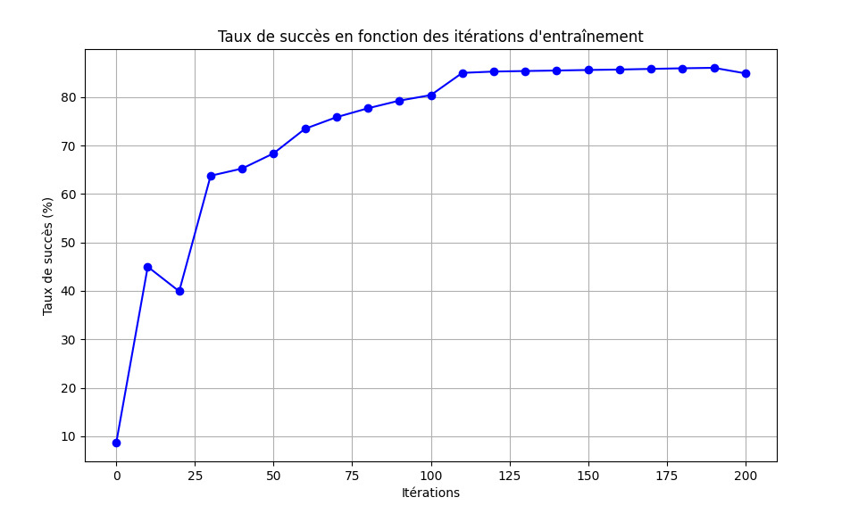

Réponses aux questions
=======================

Développement d'un réseau de neurones de A à Z :
------------------------------------------------

1. Il y a 42000 images dans le data set MNIST qui nous est fourni sur moodle (train.csv) pour entraîner notre réseau de neurones.

2. Il y a 785 valeurs dans la deuxième dimension du tableau, car il y a 784 valeurs pour chaque pixel de l'image (28x28), et un label permettant de connaître la valeur du chiffre écrit.

3. La valeur du succès après 100 itérations pour un taux d'apprentissage de 1 est d'environ 80%.

4. La valeur du succès après un deuxième entraînement de 100 itérations pour un taux d'apprentissage de 0.1 est d'environ 86%.

Il nous semble que le réseau est sous-entraîné après ces deux entraînements. Nous avons donc opté pour un entraînement longue durée avec 300 itérations pour chacun des entraînements. Nous sommes arrivés à 90% de succès après le premier entraînement, et le résultat de validation après le deuxième entraînement était de 90.4%.

Utilisation d'une librairie dédiée : Tensorflow - Keras :
--------------------------------------------------------
1. Le dictionnaire ``out.history`` enregistre l'évolution des différentes métriques au cours de chaque époque. Les principales clés de ce dictionnaire sont :

**``loss``** : La perte (fonction de coût) calculée à chaque époque.
**``accuracy``** (ou ``acc`` dans les versions antérieures de TensorFlow) : L'exactitude du modèle (ou toute autre métrique définie) à chaque époque.
**``val_loss``** : La perte calculée sur les données de validation, si un jeu de validation est spécifié.
**``val_accuracy``** (ou ``val_acc`` dans les versions antérieures de TensorFlow) : L'exactitude calculée sur les données de validation, si un jeu de validation est spécifié.

1. Le taux de succès pour un réseau de neurones avec 1 couche cachée de 10 neurones, et un taux d'apprentissage de 0.01 est de 92%.

2. Il semble qu'après 300 itérations, le taux de succès a effectivement convergé, comme on peut le voir sur le graphique ci-dessous :

   .. image:: ../results/Keras1.png
      :alt: Graphique du taux de succès de l'entraînement 1 en fonction des itérations.

3. Le taux de succès atteint pour le second entraînement (même architecture de réseau, taux d'apprentissage = 0.2), est inférieur : nous arrivons, après 300 itérations, à 85% de détection maximale. Et comme nous pouvons le voir sur le graphique suivant, le taux de succès n'est pas stabilisé.

   .. image:: ../results/Keras2.png
      :alt: Graphique du taux de succès de l'entraînement 2 en fonction des itérations.

4. Lorsque l'on augmente significativement le nombre de neurones dans la couche cachée, le taux de succès arrive autour de 90%. Comme nous avons gardé un taux d'apprentissage de 0.2, ce résultat est meilleur que pour une couche cachée de 10 neurones. De plus, le taux de succès semble avoir convergé, et est plus stable également.

   .. image:: ../results/Keras3.png
      :alt: Graphique du taux de succès de l'entraînement 3 en fonction des itérations.

5. Le taux de succès dans le cas où nous avons un réseau de neurones avec 2 couches cachées (une de 500 et une de 700) donne un résultat surprenant. En effet, le taux de succès stagne autour de 25%.

   .. image:: ../results/Keras4.png
      :alt: Graphique du taux de succès de l'entraînement 4 en fonction des itérations.

6. Comme on peut le voir sur le graphique ci-dessous, lorsque l'on divise la taille de l'échantillon par 10, la fonction de perte devient nulle très rapidement (lors des premières itérations).

   .. image:: ../results/Keras5.png
      :alt: Graphique du taux de succès de l'entraînement 5 en fonction des itérations.

Nous sommes surpris de voir que des réseaux de neurones plus complexes (avec plus de couches) ne permettent pas une meilleure détection. Voire même dans les derniers cas, avec deux couches cachées, les résultats étaient bien pires, et à peine mieux que le hasard. Nous supposons que cela est lié à une forme de surentraînement des réseaux.
